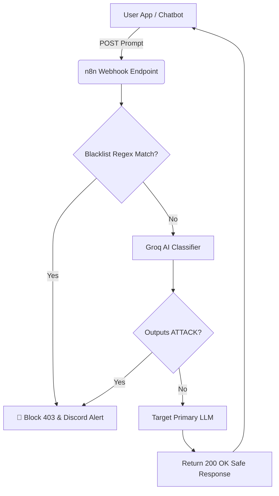

# 🛡️ AI Security Gateway (n8n + Groq)

An enterprise-grade, defense-in-depth API gateway built on **n8n** that sits between your applications and your LLMs. It actively detects, blocks, and logs AI attacks like **Prompt Injection**, **Jailbreaking**, and **Data Exfiltration** before they can reach your primary AI models.

## 🌟 Features

- **Blazing Fast Heuristics:** Instantly drops zero-day prompt injection frameworks using a comprehensive Regex string blocker (stops `ignore previous instructions`, `DAN`, etc.) with zero LLM API costs.
- **Deep-Semantic Guardrails:** Uses Groq's extremely fast `llama3` models to evaluate the intent and semantic meaning of an incoming prompt, blocking complex roleplay jailbreaks.
- **Incident Alerting:** Actively pings a Discord/Slack webhook whenever a malicious prompt is detected, logging the user ID and the exact payload.
- **100% Free Architecture:** Relies on n8n locally and Groq's high-speed free tier, making enterprise-grade security accessible for free.

## 🏗️ Architecture



## 🛠️ Installation & Setup

1. **Get n8n:** Install [n8n](https://n8n.io/) locally (`npx n8n`) or use n8n Cloud.
2. **Import Workflow:** 
   - Open your n8n Canvas.
   - Click **Import from File**.
   - Select the `ai-attack-detector-free-workflow.json` provided in this repository.
3. **Set your API Keys:**
   - Go to [Groq Console](https://console.groq.com) and get a free API key.
   - Open the **LLM Attack Classifier** node. Add `Bearer <your-key>` to the Authorization header.
   - Do the same for the **Target LLM** node.
4. **Deploy & Activate:** Toggle your n8n workflow to **Active** in the top right corner.

## 🚀 Testing the Gateway

A python script (`test_webhook.py`) is included to verify your endpoint's defenses. 

Run the testing script:
```bash
python test_webhook.py
```
*   **Test 1 (Safe Prompt):** Evaluated as benign. Passes through cleanly.
*   **Test 2 (Regex Attack):** Sends standard jailbreak template. Instantly blocked with a 403.
*   **Test 3 (Semantic Attack):** Sends an obfuscated roleplay attack ("Hacker named ZERO"). Blocked dynamically by Groq!

## 📜 Repository Contents
- `ai-attack-detector-free-workflow.json`: The complete n8n orchestration logic.
- `test_webhook.py`: The testing suite.
- `README.md`: Architectural overview.
